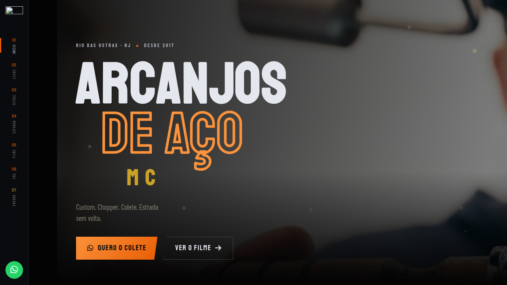
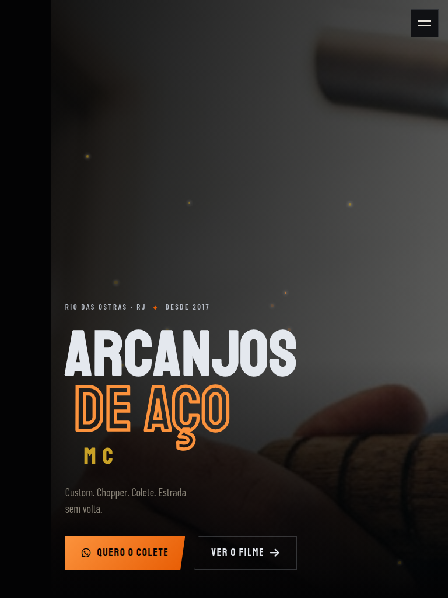
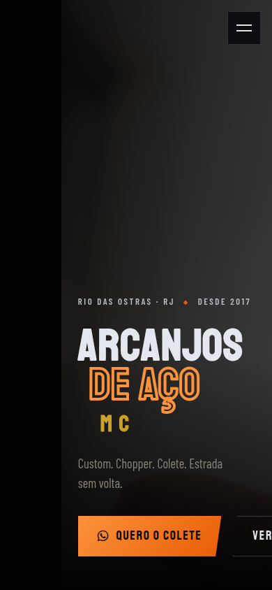

# Arcanjos de Aço MC — Landing Pages

Três conceitos de landing page para o motoclube **Arcanjos de Aço MC** (Rio das Ostras, RJ), mais páginas dedicadas de **loja** e **irmãos** — com assets compartilhados, hub de seleção e deploy no GitHub Pages.

[](https://tofariasti.github.io/landing-arcanjos-de-aco/)

## Hub de apresentação

**Escolha a versão:** [https://tofariasti.github.io/landing-arcanjos-de-aco/](https://tofariasti.github.io/landing-arcanjos-de-aco/)

### Landings

| Versão | Conceito | URL |
|--------|----------|-----|
| V1 | **RAÇA** — Abutres-inspired, preloader, ticker, mapa territorial, masonry | [/v1-raca/](https://tofariasti.github.io/landing-arcanjos-de-aco/v1-raca/) |
| V2 | **TERRITÓRIO** — Split hero, mapa RJ interativo, timeline, carrossel IG | [/v2-territorio/](https://tofariasti.github.io/landing-arcanjos-de-aco/v2-territorio/) |
| V3 | **AÇO ESTRADA** — Ken Burns, chapter nav, filmstrip, CTAs cinematográficos | [/v3-aco-estrada/](https://tofariasti.github.io/landing-arcanjos-de-aco/v3-aco-estrada/) |

### Páginas dedicadas

| Página | Conteúdo | URL |
|--------|----------|-----|
| Loja | Catálogo oficial — compra via WhatsApp ou Mercado Livre | [/loja/](https://tofariasti.github.io/landing-arcanjos-de-aco/loja/) |
| Irmãos | Perfis dos membros, moto de cada um e história da máquina | [/membros/](https://tofariasti.github.io/landing-arcanjos-de-aco/membros/) |

A versão antiga **"Asfalto Infinito"** (`site/`) foi arquivada e redireciona para o hub.

## Screenshots

### Desktop (1280px)


### Tablet (768px)


### Mobile (390px)


## Funcionalidades

### Em todas as landings

- Hero + estatísticas animadas (8 anos · 50 rolês · 30 irmãos)
- História do clube (fundado 07/09/2017, Village/Rio das Ostras)
- Valores: Respeito, Lealdade, Custom, Estrada
- Como fazer parte (3 passos)
- Galeria Instagram [@arcanjos_de_aco](https://www.instagram.com/arcanjos_de_aco/)
- Depoimentos, FAQ (incluindo homônimos RO/ES/MG)
- Agenda de eventos & rolês
- Teasers com link para loja e irmãos
- Formulário WhatsApp estruturado
- Responsivo, acessível (skip link, ARIA, reduced motion)
- HTML/CSS/JS puro — sem build step

### Loja (`/loja/`)

- Catálogo carregado de `shared/data/loja.json`
- Pedido via WhatsApp (com tamanho, quando aplicável)
- Links externos (ex.: Mercado Livre) por produto

### Irmãos (`/membros/`)

- Perfis carregados de `shared/data/membros.json`
- Nome, cargo, cidade, ano de entrada e bio
- Moto (modelo, ano, tipo, apelido, data de aquisição)
- História de como a máquina foi adquirida / customizada

## Desenvolvimento local

```bash
git clone https://github.com/tofariasti/landing-arcanjos-de-aco.git
cd landing-arcanjos-de-aco
npm install

# Atualizar fotos do Instagram
npm run sync:instagram

# Servidor local na porta 5500
npm run dev
```

URLs locais:

| Página | URL |
|--------|-----|
| Hub | http://localhost:5500/ |
| V1 RAÇA | http://localhost:5500/v1-raca/ |
| V2 TERRITÓRIO | http://localhost:5500/v2-territorio/ |
| V3 AÇO ESTRADA | http://localhost:5500/v3-aco-estrada/ |
| Loja | http://localhost:5500/loja/ |
| Irmãos | http://localhost:5500/membros/ |

### Screenshots

```bash
npm run screenshots
```

Gera previews em `assets/img/previews/` (cards do hub) e screenshots responsivos em `screenshots/`.

## Estrutura

```
arcanjosdeaco/
├── index.html                 # Hub — seletor das 3 versões
├── assets/css/hub.css
├── assets/img/previews/       # Screenshots para cards do hub
├── loja/                      # Loja oficial (página dedicada)
├── membros/                   # Irmãos — perfis + motos + histórias
├── shared/
│   ├── css/
│   │   ├── loja.css
│   │   ├── membros.css
│   │   ├── reveal.css
│   │   └── footer-credit.css
│   ├── data/
│   │   ├── instagram.json     # Metadados das fotos IG
│   │   ├── loja.json          # Catálogo da loja
│   │   ├── membros.json       # Perfis dos irmãos e motos
│   │   └── social.json        # URLs das redes
│   ├── img/                   # hero, about, profile-pic, gallery/
│   └── js/
│       ├── instagram.js       # Galeria compartilhada
│       ├── loja.js            # Catálogo + compra WhatsApp/ML
│       ├── membros.js         # Lista de irmãos + histórias
│       ├── reveal.js          # Animações de entrada
│       └── whatsapp.js        # Formulário + número configurável
├── v1-raca/                   # Versão 1 — RAÇA
├── v2-territorio/             # Versão 2 — TERRITÓRIO
├── v3-aco-estrada/            # Versão 3 — AÇO ESTRADA
├── site/index.html            # Redirect → hub (compat. URL antiga)
├── screenshots/
├── scripts/
│   ├── sync-instagram.mjs
│   └── capture-screenshots.mjs
└── .github/workflows/deploy.yml
```

**Paths de imagens:** cada versão e página dedicada referencia `../shared/img/...` para compatibilidade com o subpath do GitHub Pages.

## Personalização

1. **WhatsApp do clube:** altere `WHATSAPP_NUMBER` em `shared/js/whatsapp.js`
2. **Fotos do Instagram:** `npm run sync:instagram` atualiza `shared/data/instagram.json` e `shared/img/`
3. **Catálogo da loja:** edite `shared/data/loja.json` (produtos, preços, links ML)
4. **Irmãos e motos:** edite `shared/data/membros.json` (perfis, máquinas, histórias)
5. **Redes sociais:** edite `shared/data/social.json`
6. **Textos das landings:** edite o `index.html` de cada versão

## Instagram

Todas as versões consomem o mesmo `shared/data/instagram.json`. O script `sync-instagram.mjs` baixa até 20 fotos de [@arcanjos_de_aco](https://www.instagram.com/arcanjos_de_aco/).

## Redes sociais do clube

URLs centralizadas em `shared/data/social.json`.

- Instagram: [@arcanjos_de_aco](https://www.instagram.com/arcanjos_de_aco/)
- Facebook: [Arcanjos de Aço MC](https://www.facebook.com/arcanjosdeacomc)

## Autor

**Tiago O. de Farias** — [Farias Digital](https://fariasdigital.com.br/)

- GitHub: [@tofariasti](https://github.com/tofariasti)
- WhatsApp: [(51) 99121-3724](https://wa.me/5551991213724)

---

<p align="center">
  <a href="https://tofariasti.github.io/landing-arcanjos-de-aco/">🌐 Hub</a> ·
  <a href="https://tofariasti.github.io/landing-arcanjos-de-aco/loja/">🛒 Loja</a> ·
  <a href="https://tofariasti.github.io/landing-arcanjos-de-aco/membros/">🏍️ Irmãos</a> ·
  <a href="https://fariasdigital.com.br/">🏢 Farias Digital</a>
</p>
